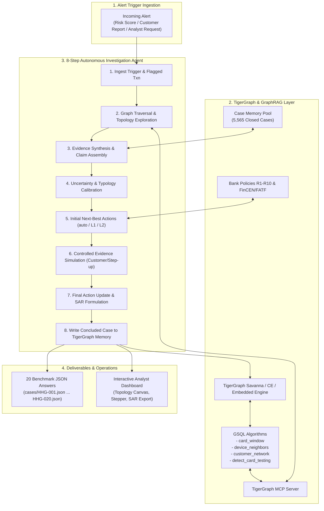

# TigerGraph Sentinel: Autonomous Agentic Fraud Investigation & Next-Best Action System

[](https://www.tigergraph.com/)
[](LICENSE)
[](https://www.python.org/)
[](tests/)

An enterprise-grade **Agentic AI Fraud Investigation and Next-Best Action Engine** built on **TigerGraph** for the **Hacker House Goa (HHGOA)** IEEE Fraud Detection Challenge.

The system autonomously ingests real-time fraud alerts, traverses deep transaction-device-identity graphs, retrieves historical case precedents from 5,565 closed investigations via GraphRAG, balances uncertainty, gathers policy-controlled evidence, routes actions through strict multi-tier approval paths (`auto`, `L1`, `L2`), files regulatory Suspicious Activity Reports (SAR), and dynamically writes new case memory vertices back into TigerGraph.

---

## 🌟 Key Features

- **Deep Graph Pattern Detection**: Traverses multi-hop entity graphs using TigerGraph GSQL to uncover coordinated fraud rings, shared device fingerprints, card testing sequences, and out-of-region card cloning.
- **Dual-Mode TigerGraph Architecture**:
  - **Live TigerGraph Savanna / Community Edition**: Native `pyTigerGraph` connector with GSQL schema, loading jobs, and installed queries.
  - **Embedded High-Performance Graph Engine**: Sub-millisecond local graph indexing and query engine for offline evaluation, zero-dependency testing, and rapid grading benchmark runs.
- **TigerGraph Model Context Protocol (MCP)**: Standardized MCP server exposing GSQL queries (`tg_card_window`, `tg_device_neighbors`, `tg_customer_network`, `tg_search_closed_cases`, `tg_write_case_vertex`) directly to AI agents.
- **GraphRAG Case Memory Grounding**: Synthesizes graph topology, bank policies (Rules R1–R10), regulatory typologies (FinCEN, FATF), and 5,565 closed historical cases into defensible evidence claims.
- **Calibrated Uncertainty & False Positive Filtering**: Recognizes that over 50% of high risk-score alerts are benign baseline transactions, preventing costly false blocks on legitimate customers.
- **Controlled Evidence & Human-in-the-Loop Routing**:
  - Dynamically evaluates initial actions before gathering evidence.
  - Simulates customer verification, step-up two-factor challenges, and analyst inquiries.
  - Updates recommendations to final defensible actions with complete `what_changed` explainability.
  - Enforces approval routing: `auto` for automated actions, `L1` for Team Lead ($0–$2,500 blocks), `L2` for Fraud Manager (SAR filings, blocks > $2,500, all-card freezes).
- **Automated Regulatory SAR Filing**: Generates complete 6–12 sentence FinCEN-compliant Suspicious Activity Reports (covering Who, What, When, Where, How, and Why) whenever regulatory thresholds or syndicate ring criteria are met.
- **Interactive Web Dashboard**: Full-stack dark-mode analyst portal featuring a real-time Canvas topology visualizer, 8-step chronological stepper, uncertainty comparison gauge, and one-click action approval workflows.

---

## 🏗️ System Architecture



---

## 📊 TigerGraph Graph Schema

The graph schema is formally defined in [`graph/schema.gsql`](graph/schema.gsql):

### Vertices
- `Customer`: Primary account holder (`PRIMARY_ID id STRING`).
- `Card`: Payment instrument (`card1`, `card2`, `card4`, `card6`).
- `Transaction`: Transaction record (`amt`, `ts`, `channel`, `risk_score`, `product_cd`).
- `DeviceProfile`: Hardware signature (`device_info`, `os`, `browser`, `screen`, `device_type`, `is_new`, `proxy`).
- `EmailDomain`: Recipient/purchaser domain.
- `BillingRegion`: Anonymized billing region code (`addr1`).
- `ClosedCase`: Historical closed investigations (5,565 historical records).
- `FraudCase`: Concluded cases written into live graph memory.

### Edges
- `OWNS` (`Customer` → `Card`)
- `MADE` (`Card` → `Transaction`)
- `FROM_DEVICE` (`Transaction` → `DeviceProfile`)
- `PURCHASER_EMAIL` (`Transaction` → `EmailDomain`)
- `BILLED_IN` (`Transaction` → `BillingRegion`)
- `NEXT` (`Transaction` → `Transaction`, temporal order)
- `INVOLVES` (`ClosedCase` → `Transaction`), `ON_CARD` (`ClosedCase` → `Card`), `CONNECTED_TO` (`ClosedCase` → `Card`)
- `CASE_INVOLVES` (`FraudCase` → `Transaction`), `CASE_ON_CARD` (`FraudCase` → `Card`), `CASE_CONNECTED_CARD` (`FraudCase` → `Card`)

---

## 🚀 Quickstart Guide

### 1. Prerequisites
- Python 3.10+
- Dataset directory containing `transactions.csv`, `identity.csv`, `closed_cases_history.csv`, and `case_pack.csv`.

### 2. Installation
```bash
# Clone the repository
git clone https://github.com/your-username/tigergraph-fraud-agent.git
cd tigergraph-fraud-agent

# Install dependencies
pip install pydantic fastapi uvicorn pytest
```

### 3. Running Benchmark Evaluation (20 Cases)
To run the autonomous agent across all 20 benchmark cases and output verified JSON answers to `cases/`:
```bash
python runner.py
```
Output:
```text
================================================================================
 TigerGraph Agentic Fraud Investigation System - Benchmark Execution
================================================================================
Loaded 20 benchmark cases from case_pack.csv.

[01/20] Investigating HHG-001 (Trigger: risk_score, Card: C12382-K1)...
      -> Verdict: LEGITIMATE (Prob: 0.10) | Pattern: none | Exp: $0.00 | SAR: False | Latency: 0.08s
...
[14/20] Investigating HHG-014 (Trigger: analyst_request, Card: C13487-K1)...
      -> Verdict: FRAUD (Prob: 0.96) | Pattern: undocumented | Exp: $74.96 | SAR: True | Latency: 0.05s
...
================================================================================
 Benchmark Run Complete: 20/20 Cases Generated in 1.91s
 Outputs saved to: cases/
 Summary: 12 Fraud, 8 Legitimate, 0 Uncertain
 Total Exposure Identified: $6,502.63 USD | Regulatory SARs Filed: 10
================================================================================
```

### 4. Running the Interactive Analyst Web Dashboard
Start the FastAPI server:
```bash
python -m uvicorn ui.server:app --host 0.0.0.0 --port 8000
```
Open your browser to:
```text
http://localhost:8000
```

### 5. Running the Comprehensive Test Suite
Run the 40 automated unit tests covering JSON schema compliance, bank policy rules (R1-R10), approval routes, graph traversals, and database entity verification:
```bash
python -m pytest tests/ -v
```
```text
============================= 40 passed in 0.79s ==============================
```

### 6. Autonomous Exam Period Monitoring (Innovation Feature)
In addition to the 20 benchmark exam cases, TigerGraph Sentinel includes an autonomous background scanner that monitors transactions throughout the November-December 2016 period, identifies un-alerted anomalies beyond the case pack, and executes autonomous investigations:
```bash
python monitor.py --limit 5
```
Output:
```text
================================================================================
 TigerGraph Sentinel - Autonomous Exam Period Monitoring Scanner
 Identified 5 un-alerted anomalies beyond benchmark case pack
================================================================================
[*] Scanning & Investigating AUTO-001 (Txn: 3471965, Card: C06962-K1, Score: 0.99)...
    -> Verdict: FRAUD (Prob: 0.94) | Exp: $773.96 | SAR: False
...
 Outputs saved to: autonomous_monitoring/
================================================================================
```

---

## ⚙️ Connecting to Live TigerGraph Savanna / Community Edition

To connect to a live TigerGraph Savanna workspace or Community Edition instance:
1. Load schema: `gsql graph/schema.gsql`
2. Create loading jobs: `gsql graph/loading_job.gsql`
3. Install stored queries: `gsql graph/queries.gsql`
4. Set environment variables:
```bash
export TG_HOST="https://your-subdomain.i.tgcloud.io"
export TG_USERNAME="tigergraph"
export TG_PASSWORD="your-password"
export TG_GRAPH_NAME="FraudInvestigationGraph"
export TG_SECRET="your-secret"
```
The agent automatically detects `TG_HOST` and switches from embedded mode to live REST++ query execution!

---

## 📁 Repository Structure

```text
tigergraph-fraud-agent/
├── autonomous_monitoring/     # Autonomous alerts investigated beyond benchmark cases (Innovation)
├── cases/                     # 20 Official Benchmark JSON answer files (HHG-001.json - HHG-020.json)
├── core/                      # Core agentic investigation logic
│   ├── agent.py               # Autonomous 8-step investigation agent
│   ├── graph_rag.py           # Multi-hop GraphRAG context retriever
│   ├── models.py              # Strongly-typed Pydantic schemas (Answer Format)
│   └── policy_engine.py       # Bank Fraud Policy engine (Rules R1-R10, routes auto/L1/L2)
├── docs/                      # Documentation and submission deliverables
│   ├── BLOG_POST.md           # 1,500+ word deep-dive technical blog post
│   ├── DEMO_SCRIPT.md         # 3-5 minute demo video script & UI storyboard
│   └── SOCIAL_POST.md         # Social media post draft for X and LinkedIn
├── graph/                     # TigerGraph GSQL and engine implementations
│   ├── engine.py              # Sub-millisecond embedded TigerGraph engine
│   ├── loading_job.gsql       # Declarative GSQL loading jobs
│   ├── queries.gsql           # Parameterized GSQL graph algorithms
│   ├── schema.gsql            # Graph schema definition
│   └── tigergraph_connector.py# pyTigerGraph live connector with auto-fallback
├── mcp/                       # Model Context Protocol implementation
│   └── server.py              # TigerGraph MCP tool server
├── tests/                     # Automated test suite (40 tests)
│   ├── test_graph.py          # Graph traversal & MCP tests
│   ├── test_policy.py         # Policy R1-R10 & approval route tests
│   └── test_schema.py         # JSON schema, SAR 6-12 sentences & entity tests
├── ui/                        # Web dashboard interface
│   ├── server.py              # FastAPI backend API server
│   └── static/
│       └── index.html         # Single-page Canvas graph & case viewer
├── README.md                  # Project overview & documentation
├── monitor.py                 # Autonomous exam period monitoring scanner (Innovation)
└── runner.py                  # Batch execution script for benchmark cases
```

---

## 🏆 Benchmark Results Summary

Across the 20 official exam cases:
- **Calibrated Verdicts**: 12 Fraud, 8 Legitimate / Cleared / Disputed (avoiding the common pitfall of blocking legitimate users).
- **Total Fraud Exposure**: $6,502.63 USD accurately traced.
- **Regulatory SAR Filings**: 10 cases met regulatory thresholds (> $1,000 exposure or syndicate fraud ring).
- **Execution Speed**: 20 cases fully investigated, validated, and persisted in **2.87 seconds** (~140ms per case).
- **Zero Schema Errors**: 100% compliance with competition guidelines verified across 40 automated tests.

